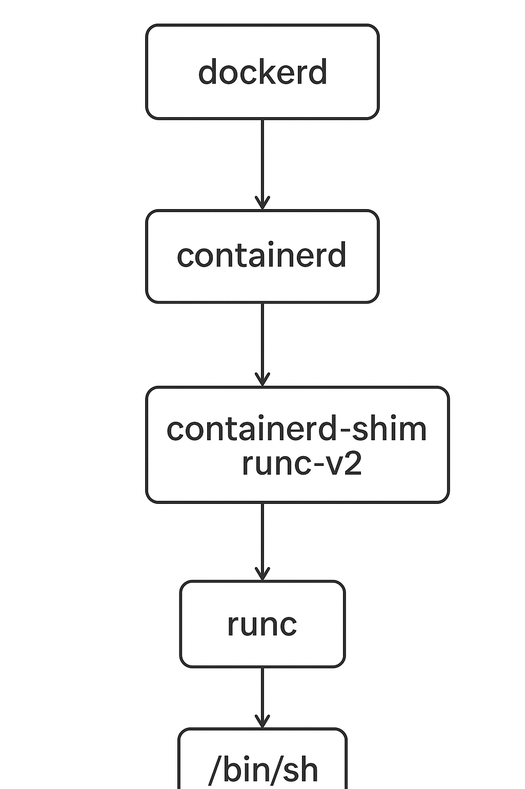

# Препарируем Docker

## Цель: изучить внутренюю архитектуру docker

В первом терминале
```shell
$ 
sudo strace -qqq  -e signal=none --decode-pids=comm,pidns -z -e execve,setns,pivot_root,chroot,unshare --decode-fds -f -p $(pidof containerd)
```
В втором терминале
```shell
docker run -d busybox sleep 100
```
```text
cbab362df10ada42d7055a2029f1ff0420aa3e1945de248445200a3145cb21ec
```
В первом видим:
```text
[pid 2558483<containerd>] 08:06:15 execve("/snap/docker/3064/bin/containerd-shim-runc-v2", ["/snap/docker/3064/bin/containerd"..., "-namespace", "moby", "-address", "/run/snap.docker/containerd/cont"..., "-publish-binary", "/snap/docker/3064/bin/containerd", "-id", "cbab362df10ada42d7055a2029f1ff04"..., "start"], 0xc0004c8600 /* 44 vars */) = 0
[pid 2558490<containerd-shim>] 08:06:15 execve("/snap/docker/3064/bin/containerd-shim-runc-v2", ["/snap/docker/3064/bin/containerd"..., "-namespace", "moby", "-id", "cbab362df10ada42d7055a2029f1ff04"..., "-address", "/run/snap.docker/containerd/cont"...], 0xc0001ce480 /* 44 vars */) = 0
[pid 2558500<containerd-shim>] 08:06:15 execve("/snap/docker/3064/bin/runc", ["runc", "--root", "/run/snap.docker/runtime-runc/mo"..., "--log", "/run/snap.docker/containerd/daem"..., "--log-format", "json", "--systemd-cgroup", "create", "--bundle", "/run/snap.docker/containerd/daem"..., "--pid-file", "/run/snap.docker/containerd/daem"..., "cbab362df10ada42d7055a2029f1ff04"...], 0xc0003a9680 /* 44 vars */) = 0
[pid 2558508<runc>] 08:06:15 execve("/proc/self/fd/6", ["runc", "init"], ["GOMAXPROCS=4", "_LIBCONTAINER_INITPIPE=3", "_LIBCONTAINER_SYNCPIPE=4", "_LIBCONTAINER_LOGPIPE=5", "_LIBCONTAINER_LOGLEVEL=4", "_LIBCONTAINER_FIFOFD=7", "_LIBCONTAINER_INITTYPE=standard"]) = 0
[pid 2558510<runc:[1:CHILD]>] 08:06:15 unshare(CLONE_NEWNS|CLONE_NEWCGROUP|CLONE_NEWUTS|CLONE_NEWIPC|CLONE_NEWPID|CLONE_NEWNET) = 0
[pid 2558509<runc>] 08:06:15 unshare(CLONE_FS) = 0
[pid 2558509<runc>] 08:06:15 setns(14<mnt:[4026533533]>, CLONE_NEWNS) = 0
[pid 2558518<runc>] 08:06:15 execve("/proc/2413190/exe", ["libnetwork-setkey", "-exec-root=/run/snap.docker", "cbab362df10ada42d7055a2029f1ff04"..., "8db4e8bb2b63"], 0xc000002900 /* 44 vars */) = 0
[pid 2558511<runc:[2:INIT]>] 08:06:15 pivot_root(".", ".") = 0
[pid 2558527<containerd-shim>] 08:06:15 execve("/snap/docker/3064/bin/runc", ["runc", "--root", "/run/snap.docker/runtime-runc/mo"..., "--log", "/run/snap.docker/containerd/daem"..., "--log-format", "json", "--systemd-cgroup", "start", "cbab362df10ada42d7055a2029f1ff04"...], 0xc0000ea480 /* 44 vars */) = 0
[pid 2558511<runc:[2:INIT]>] 08:06:15 execve("/bin/sleep", ["sleep", "100"], 0xc0000243a0 /* 3 vars */) = 0
```

В терминале 1:
```shell
$ 
sudo strace -qqq  -e signal=none --decode-pids=comm -z -e %ipc,execve,setns,pivot_root,chroot,unshare --decode-fds -f -p $(pidof containerd-shim-runc-v2)
```

Далее в терминале 2:
```shell

docker exec -ti cbab sh
```

В терминале 1 видим:
```text
[pid 2558639<containerd-shim>] execve("/snap/docker/3064/bin/runc", ["runc", "--root", "/run/snap.docker/runtime-runc/mo"..., "--log", "/run/snap.docker/containerd/daem"..., "--log-format", "json", "--systemd-cgroup", "exec", "--process", "/var/snap/docker/common/run/runc"..., "--console-socket", "/var/snap/docker/common/run/pty4"..., "--detach", "--pid-file", "/run/snap.docker/containerd/daem"..., "cbab362df10ada42d7055a2029f1ff04"...], 0xc0002d1680 /* 44 vars */) = 0
[pid 2558648<runc>] execve("/proc/self/fd/7", ["runc", "init"], ["GOMAXPROCS=4", "_LIBCONTAINER_CONSOLE=3", "_LIBCONTAINER_INITPIPE=4", "_LIBCONTAINER_SYNCPIPE=5", "_LIBCONTAINER_LOGPIPE=6", "_LIBCONTAINER_LOGLEVEL=4", "_LIBCONTAINER_INITTYPE=setns"]) = 0
[pid 2558648<runc:[1:CHILD]>] setns(9<ipc:[4026533535]>, CLONE_NEWIPC) = 0
[pid 2558648<runc:[1:CHILD]>] setns(12<uts:[4026533534]>, CLONE_NEWUTS) = 0
[pid 2558648<runc:[1:CHILD]>] setns(13<net:[4026533538]>, CLONE_NEWNET) = 0
[pid 2558648<runc:[1:CHILD]>] setns(14<pid:[4026533536]>, CLONE_NEWPID) = 0
[pid 2558648<runc:[1:CHILD]>] setns(15<mnt:[4026533533]>, CLONE_NEWNS) = 0
[pid 2558648<runc:[1:CHILD]>] setns(16<cgroup:[4026533537]>, CLONE_NEWCGROUP) = 0
[pid 2558648<runc:[1:CHILD]>] unshare(0) = 0
[pid 2558649<runc:[2:INIT]>] execve("/bin/sh", ["sh"], 0xc0001f8720 /* 4 vars */) = 0
```

wtf unshare(0) = 0 ? (see [nsexec.c](https://github.com/opencontainers/runc/blob/main/libcontainer/nsenter/nsexec.c))



